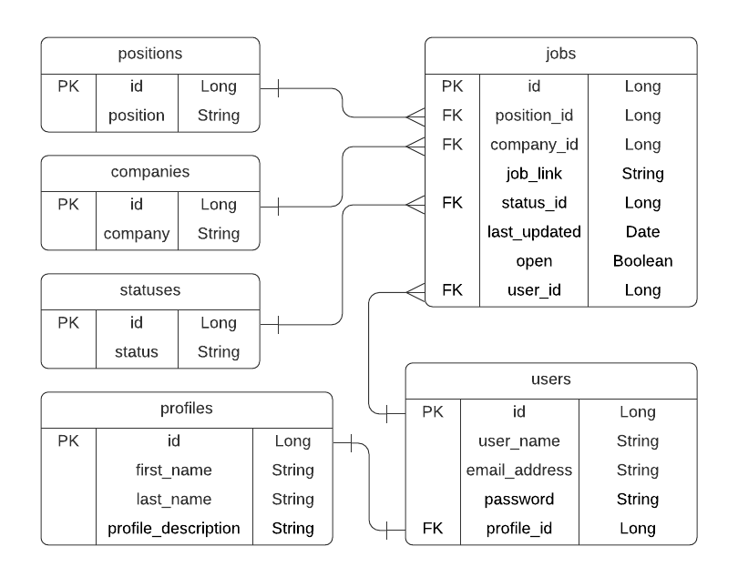
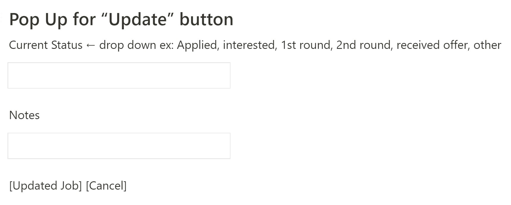

# CSRiseUp

## MVP Section

### Project Description

Are you a person looking for a job? Are you having trouble tracking all the places you applied to? Look no further! We have your back! You can track all you application in one place and be organized throughout your job search process

### User Stories
- As a user, I should be able to add a job.
- As a user, I should be able to update my status for a job.
- As a user, I should be able to update a to no longer interested or rejected, so that I can focus on the jobs I'm currently applying to.
- As a user, I should be able to filter the jobs by closed opportunities, so that I reference the jobs that I've applied to in the past.
- As a user, I should be able to filter the jobs by open opportunities, so that I can focus on the jobs I'm currently applying to.
### ERD

### Wireframes

## MVP and Beyond

### Project Description

Are you a tech person looking for a career in Computer Science? Are you having trouble tracking all the places you submitted your applications to and/or all the leetcode problems you've done so far? Look no further! CSRiseUp has your back! You can track all your applications and leetcode in one place. Be organized throughout your job search process and rise up in CS.
