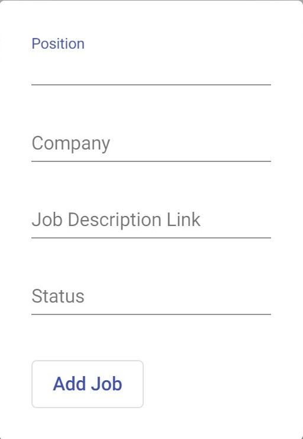
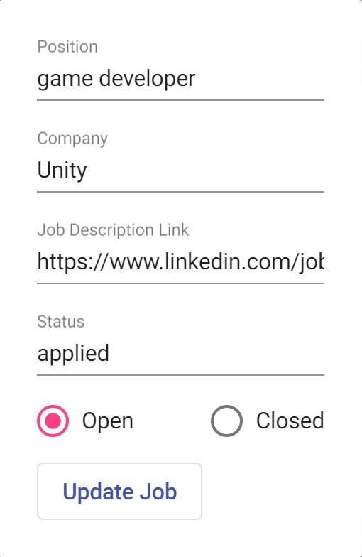

# CSRiseUp

## MVP Section

### Project Description

Are you a person looking for a job? Are you having trouble tracking all the places you applied to? Look no further! We have your back! You can track all your applications in one place and be organized throughout your job search process

### User Stories

- As a user, I should be able to add a job.

  

- As a user, I should be able to update my status for a job.
- As a user, I should be able to update a to no longer interested or rejected, so that I can focus on the jobs I'm currently applying to.
- As a user, I should be able to filter the jobs by closed opportunities, so that I reference the jobs that I've applied to in the past.
- As a user, I should be able to filter the jobs by open opportunities, so that I can focus on the jobs I'm currently applying to.
  

### ERD


### Endpoints

[Link to backend](https://github.com/MichelleLucero/csriseup-api)

### Wireframes

|       Expectation        |             Reality              |
| :----------------------: | :------------------------------: |
|             |             |
|     |     |
|  |  |

### Demo

[Demo](https://csriseup.herokuapp.com/)

### MVP Hurdles

- User authentication
  - debugger
  - inspect network activity
- How will users add/update jobs?
  

```
public class JobRequest {

    private String position;

    private String company;

    private String jobLink;

    private String status;

    private boolean open;

    public String getPosition() {
        return position;
    }

    public void setPosition(String position) {
        this.position = position;
    }

    public String getCompany() {
        return company;
    }

    public void setCompany(String company) {
        this.company = company;
    }

    public String getJobLink() {
        return jobLink;
    }

    public void setJobLink(String jobLink) {
        this.jobLink = jobLink;
    }

    public String getStatus() {
        return status;
    }

    public void setStatus(String status) {
        this.status = status;
    }

    public boolean isOpen() {
        return open;
    }

    public void setOpen(boolean open) {
        this.open = open;
    }
}
```

In my JobService

```
    public Job createJob(JobRequest jobRequestObject){
        LOGGER.info("calling createJob method from service");
        MyUserDetails userDetails = (MyUserDetails) SecurityContextHolder.getContext().getAuthentication().getPrincipal();
        Job job = new Job(jobRequestObject.getJobLink(), LocalDate.now(), true, userDetails.getUser());

        Position position = positionRepository.findByPosition(jobRequestObject.getPosition());
        Company company = companyRepository.findByCompany(jobRequestObject.getCompany());
        Status status = statusRepository.findByStatus(jobRequestObject.getStatus());
        if( position != null){
            job.setPosition(position);
        } else {
            Position addPosition = new Position(jobRequestObject.getPosition());
            positionRepository.save(addPosition);
            Position addPositionWithId = positionRepository.findByPosition(jobRequestObject.getPosition());
            job.setPosition(addPositionWithId);
        }
        if( company != null){
            job.setCompany(company);
        } else {
            Company addCompany = new Company(jobRequestObject.getCompany());
            companyRepository.save(addCompany);
            Company addCompanyWithId = companyRepository.findByCompany(jobRequestObject.getCompany());
            job.setCompany(addCompanyWithId);
        }
        if( status != null ){
            job.setStatus(status);
        } else {
            Status addStatus = new Status(jobRequestObject.getStatus());
            statusRepository.save(addStatus);
            Status addStatusWithId = statusRepository.findByStatus(jobRequestObject.getStatus());
            job.setStatus(addStatusWithId);
        }
        return jobRepository.save(job);
    }
```

- Finding out Boostrap was incompatible with Angular
  - Angular Material

## Beyond MVP

### Project Description

Are you a tech person looking for a career in Computer Science? Are you having trouble tracking all the places you submitted your applications to and/or all the leetcode problems you've done so far? Look no further! CSRiseUp has your back! You can track all your applications and leetcode in one place. Be organized throughout your job search process and rise up in CS.
